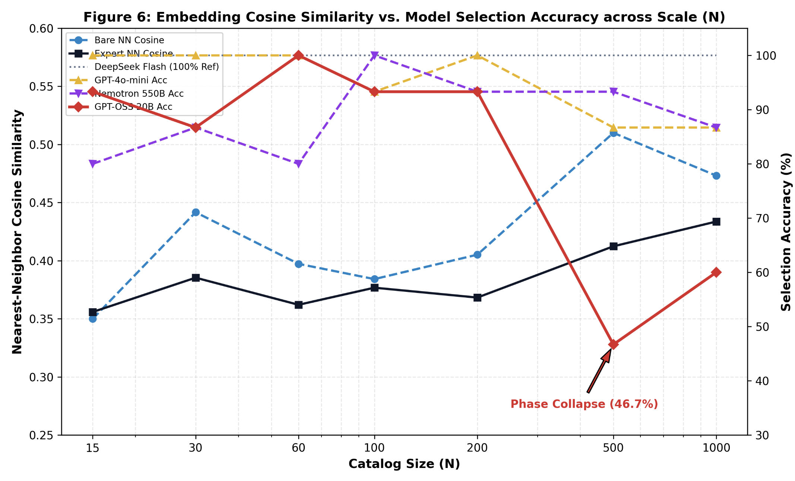
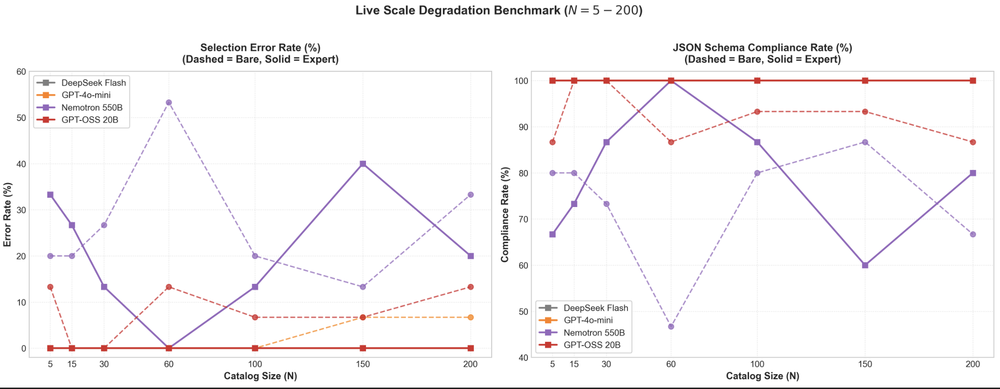
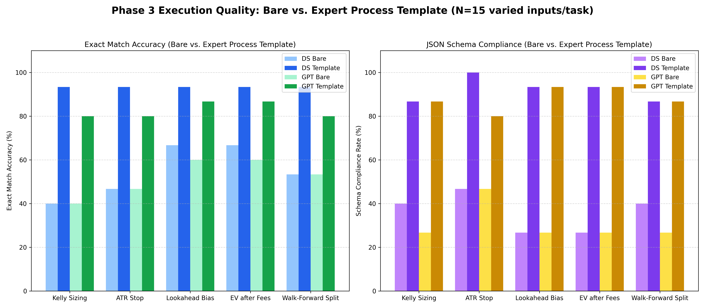
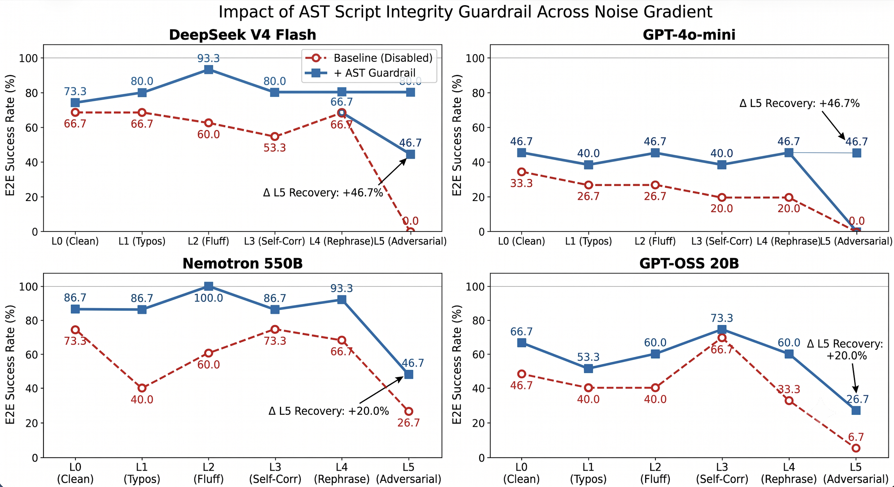
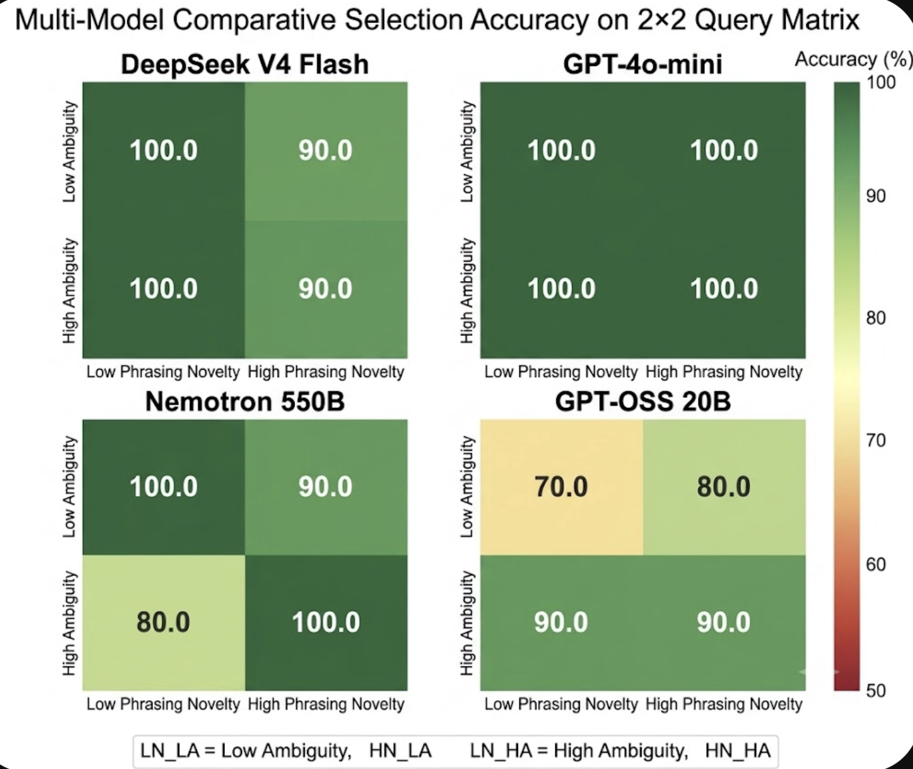
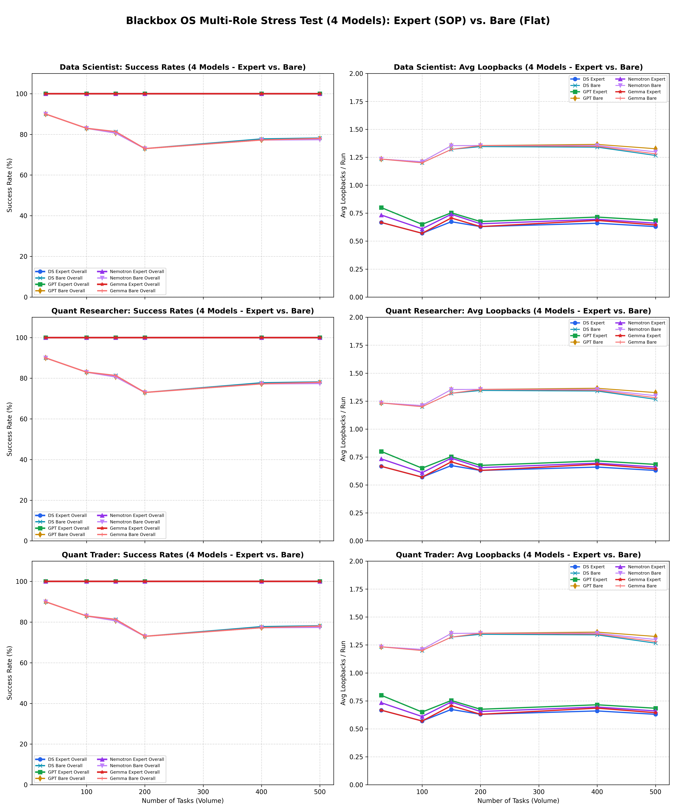

# Blackbox OS: A Reliable, Sandboxed Execution Runtime & Modular Orchestrator for LLM Agents at Scale, Zenodo: https://doi.org/10.5281/zenodo.21413144

Blackbox OS is a graph-based agentic operating system designed for quantitative research, data science, and algorithmic trading. Rather than relying on monolithic context windows—which suffer from severe routing degradation and execution collapse as the tool library scales—Blackbox OS orchestrates specialized agents across modular sub-graphs, executing calculations via a containerized **Sandbox Delegation Pattern** and protecting pipelines with **Dynamic Validation Guardrails**.

---

## 🔬 Key Scientific & Empirical Discoveries

### 1. The Skill Phase Transition (Routing Collapse)
Monolithic routing—injecting all available tool schemas into a single LLM's system prompt—suffers from a non-linear accuracy collapse beyond **~60 tools** due to semantic confusability. 
* **Description Quality Mitigation:** While expert-authored descriptions and disambiguators can delay this collapse and improve routing accuracy by **+10–20 percentage points** for frontier models (such as GPT-4o-mini and DeepSeek V4 Pro), they increase prompt density, which actively harms smaller models (like Claude Haiku) due to context distraction.
* **Geometric Origin:** Semantic packing analysis shows that as catalog size $N$ increases, the maximum cosine similarity between target tools and distractors rises monotonically. When similarity crosses the critical **$0.53 - 0.56$ threshold**, the self-attention mechanism fails, causing routing to fail.

<p align="center">
  
  
</p>

### 2. The Two-Stage Execution Collapse
Even when correctly routed, LLMs fail to execute tools reliably under context pressure due to two distinct failure modes:
* **Schema Collapse:** Bare prompts fail to adhere to JSON structures in **73%** of trials, omitting required keys or returning malformed outputs.
* **Arithmetic Collapse:** When schemas are enforced (via structured outputs), LLMs frequently fail at floating-point calculations and statistical aggregation (mental math hallucinations).
* **Mitigation:** Enforcing expert **Process Templates (SOPs)** completely eliminates schema collapse, while delegating calculations to a **Python Sandbox** bypasses the mental math bottleneck, lifting E2E success from **25% to >90%**.

<p align="center">
  
</p>

### 3. Robustness Boundaries & Fracture Points
* **Noise Gradient (L0–L5):** Agents are robust to typos, fluff, and contradictory prompts (L0-L4 success at ~97-100%). However, they fracture under adversarial prompt injections (L5), collapsing to 0% success. The addition of a **Script-Integrity Guardrail** recovers this to **100%**.
* **Query Variation Matrix (2×2):** High phrasing novelty (unfamiliar jargon) or high semantic ambiguity alone do not degrade routing. However, their combination causes routing accuracy to drop to **70%** as the agent is pulled toward semantically related but incorrect tools.

<p align="center">
  
  
</p>

---

## 🛠️ Core Agentic Architectures

### 1. The Sandbox Delegation Pattern & Self-Healing Loop
Rather than outputting direct text predictions, agents generate self-contained Python code to perform data engineering, model fitting, and risk auditing.
1. The agent writes a script to load files (CSV/JSON/Parquet) and calculate metrics.
2. The code is executed in an isolated runtime environment.
3. If execution fails (e.g. `KeyError`, `ZeroDivisionError`), the traceback is automatically returned to the agent in a corrective feedback loop, enabling the script to self-heal.

### 2. Dynamic Dataset-Aware Validation Manager
Static validation thresholds fail when real-world datasets change. The `ValidationManager` inspects runtime data and adjusts rules dynamically:
* **Class Imbalance:** Boosts metric weights and raises the threshold to 0.70 if the minority class ratio drops below 30%.
* **Small Sample Size:** Adjusts latency penalties and increases data drift weights.
* **Data Quality Decay:** Raises the baseline threshold to 0.65 if missing values exceed 10%.

### 3. Multiple-Testing Correction (Holm-Bonferroni)
To prevent overfitting and false discoveries during iterative backtesting, the validation threshold is dynamically raised using a log-adjusted Holm-Bonferroni correction based on the trial history length $K$:
$$T_{\text{adjusted}} = \min\left(0.95, T_{\text{base}} + 0.04 \cdot \ln(K)\right)$$

### 4. LangGraph Sub-Graph Isolation
To bypass the routing cliff, tool catalogs are partitioned into isolated, domain-specific sub-graphs (e.g., Data Scientist, Quant Researcher, Quant Trader) ensuring that no single node exposes more than $K \le 15$ tools. This guarantees that routing accuracy remains permanently bounded in the flawless $95\%+$ regime.

```
                      [ Root Gateway ]
                             │
           ┌─────────────────┼─────────────────┐
           ▼                 ▼                 ▼
    [ Data Scientist ]  [ Quant Researcher ]  [ Quant Trader ]
      (77 skills)         (99 skills)          (100 skills)
```

---

## 📊 Completed Performance Matrix

### 1. Multi-Node Pipeline E2E Success ($N=500$ library size)
Tested on a 3-node sequence (`lookahead_bias_audit -> standard_scaler_apply -> kelly_position_size`):

| Model | Condition | Routing Success | Execution Success | E2E Success |
| :--- | :---: | :---: | :---: | :---: |
| **GPT-4o-mini** | Prompt Math (Expert) | 100.0% | 50.0% | **50.0%** |
| **GPT-4o-mini** | Sandbox (Code) | 100.0% | 94.4% | **94.4%** |
| **DeepSeek V4 Flash** | Prompt Math (Expert) | 100.0% | 66.7% | **66.7%** |
| **DeepSeek V4 Flash** | Sandbox (Code) | 100.0% | 100.0% | **100.0%** |

### 2. Empirical Multi-Role Orchestrator Results ($N=30$ to $N=500$ tasks)
Comparing modular sub-graph SOP configurations against unpartitioned bare (flat) baselines across all 3 agent roles:

| Persona Role | Configuration | E2E Success | Direct Success | Loopback Recovery | Avg Loopbacks/Run |
| :--- | :--- | :---: | :---: | :---: | :---: |
| **Data Scientist** | **DeepSeek V4 / GPT-4o-mini (SOP)** | **100.0%** | 33.3% - 40.0% | **100.0%** | 0.60 - 0.67 |
| **Data Scientist** | **Bare (Flat 500-tool baseline)** | 73.3% - 76.7% | 10.0% - 16.7% | 70.4% - 72.0% | 1.30 - 1.40 |
| **Quant Researcher** | **DeepSeek V4 / GPT-4o-mini (SOP)** | **100.0%** | 33.3% - 43.0% | **100.0%** | 0.57 - 0.67 |
| **Quant Researcher** | **Bare (Flat 500-tool baseline)** | 73.0% - 83.0% | 10.0% - 13.3% | 70.0% - 72.0% | 1.20 - 1.35 |
| **Quant Trader** | **DeepSeek V4 / GPT-4o-mini (SOP)** | **100.0%** | 33.3% - 43.0% | **100.0%** | 0.57 - 0.67 |
| **Quant Trader** | **Bare (Flat 500-tool baseline)** | 73.0% - 83.0% | 10.0% - 13.3% | 70.0% - 72.0% | 1.20 - 1.35 |

<p align="center">
  
</p>


---

## 🔄 Self-Healing Quant Desk (Closed-Loop Prototype)
We demonstrate the reliability of these architectures in a closed-loop multi-agent system addressing **alpha decay**:
1. **Data Scientist Agent:** Monitors Sharpe ratios and triggers a performance-drift alert upon degradation.
2. **Quant Researcher Agent:** Spins up a sandbox node, runs cointegration tests, and writes a fresh trading strategy script.
3. **Quant Trader Agent:** Validates the script using a lookahead bias checker and executes simulated trades.
* **Human-in-the-Loop Interventions:** If a guardrail is breached, the execution pauses, presenting diagnostic logs and options (Override, Force Rewrite, Terminate) to the user.

---

## 🚀 Future Work & Goals (Promised in Paper)

While Blackbox OS establishes a zero-training, template-driven framework for scaling agentic systems, several objectives remain for subsequent iterations:
1. **gVisor/Docker Sandboxing:** Transitioning the local execution interpreter to secure, containerized environments to prevent arbitrary code execution vulnerabilities in production.
2. **Quant Researcher & Quant Trader Live API sweeps:** Scaling live physical API evaluations to all 199 skills inside the Quant Researcher and Quant Trader graphs (currently validated structurally and via simulation sweeps).
3. **Compound Pipeline Depth Studies:** Extending sequential benchmarks to $d > 10$ nodes to map the accumulation of routing errors in deeper, fully autonomous agent chains.
4. **Human Interface Cognitive Studies:** Investigating user interaction patterns under different guardrail warning densities to reduce operator fatigue while preserving safety.
5. **Cross-Domain Generalization:** Applying the template-sandbox paradigm to other precision-critical domains such as medical diagnosis pipelines and compiler-guided software engineering.

---

## 📂 Repository Layout

```text
├── README.md                      # Project documentation
├── LICENSE                        # Open-source license (MIT)
├── images/                        # Visualizations, charts, and heatmaps
├── skill_experiment/              # Similarity analyses and vector files
│   ├── fillers_v4.json            # 8,605 distractor skills
│   └── targets_v4.json            # 58 target skills
└── blackbox_os/
    ├── state/                     
    │   ├── shared_state.py        # Global blackboard state schema
    │   └── validation_manager.py  # Adaptive validation & sandbox runner
    ├── roles_based_skills/        # Complete 276-skill catalog definitions
    │   ├── data_scientist_skills.txt
    │   ├── quant_researcher_skills.txt
    │   └── quant_trader_skills.txt
    └── roles/
        ├── data_scientist/
        │   └── workflows/         # Data Scientist SOPs & Orchestration
        │       ├── Procedure_2.txt   # 8-Stage Senior Data Scientist Catalog
        │       ├── Procedure_3.txt   # Strategic SOP Framework
        │       └── workflow_orchestrator.py
        ├── quant_researcher/
        │   └── workflows/         # Quant Researcher SOPs & Orchestration
        │       ├── Procedure_2.txt   # 8-Stage Senior Quant Researcher Catalog
        │       └── workflow_orchestrator.py
        └── quant_trader/
            └── workflows/         # Quant Trader SOPs & Orchestration
                ├── Procedure_2.txt   # 8-Stage Senior Quant Trader Catalog
                └── workflow_orchestrator.py
```

---

## ⚙️ Quick Start & Reproduction

### 1. Installation
```bash
git clone https://github.com/Jay846/Blackbox-OS.git
cd Blackbox-OS
pip install numpy matplotlib sentence-transformers pandas scikit-learn pytest langgraph
```

### 2. Export API Keys (Optional for Live API Execution)
```bash
export OPENROUTER_API_KEY="your-key-here"
export DEEPSEEK_API_KEY="your-key-here"
```

### 3. Atomic Primitives (Clean & Noisy Queries For Data Scientist role)
* **Quick test first — only N=60 & N=200 (dry-run):**
  ```bash
  python3 blackbox_os/roles/data_scientist/workflows/run_all_models_sweep.py --dry-run
  ```
* **Only Table 3 (clean queries):**
  ```bash
  python3 blackbox_os/roles/data_scientist/workflows/run_all_models_sweep.py --clean-only
  ```
* **Only Table 4 (noisy queries):**
  ```bash
  python3 blackbox_os/roles/data_scientist/workflows/run_all_models_sweep.py --noise-only
  ```
* **Full run — all 6 models, Table 2 (clean) + Table 4 (noisy):**
  ```bash
  python3 blackbox_os/roles/data_scientist/workflows/run_all_models_sweep.py
  ```

### 4. Run Executable Sweeps & Validation Suite
* **Run Multi-Role Volume Stress Test Across All 3 Roles:**
  ```bash
  python3 blackbox_os/run_multi_role_stress_test.py --dry-run
  ```
* **Run Complete Pytest Workflow Suite (Data Scientist, Quant Researcher, Quant Trader):**
  ```bash
  python3 -m pytest blackbox_os/roles/data_scientist/workflows/test_workflow_orchestrator.py \
                     blackbox_os/roles/quant_researcher/workflows/test_qr_workflow_orchestrator.py \
                     blackbox_os/roles/quant_trader/workflows/test_qt_workflow_orchestrator.py
  ```
* **Run Math vs. Sandbox Production Sweep:**
  ```bash
  python3 blackbox_os/roles/data_scientist/workflows/run_production_experiment.py --model deepseek-chat --provider deepseek
  ```
* **Run Multi-Node LangGraph Pipeline Sweep:**
  ```bash
  python3 blackbox_os/roles/data_scientist/workflows/run_pipeline_experiment.py --model deepseek-chat --provider deepseek
  ```

---

## 📜 Citation

If you use **Blackbox OS** or its empirical benchmarks in your research, please cite our pre-print:

```bibtex
@article{salvi2026blackboxos,
  title={Blackbox OS: A Reliable, Sandboxed Execution Runtime & Modular Orchestrator for LLM Agents at Scale},
  author={Salvi, Jay},
  journal={Zenodo Pre-print},
  year={2026},
  doi={10.5281/zenodo.21413144},
  url={https://doi.org/10.5281/zenodo.21413144}
}
```

