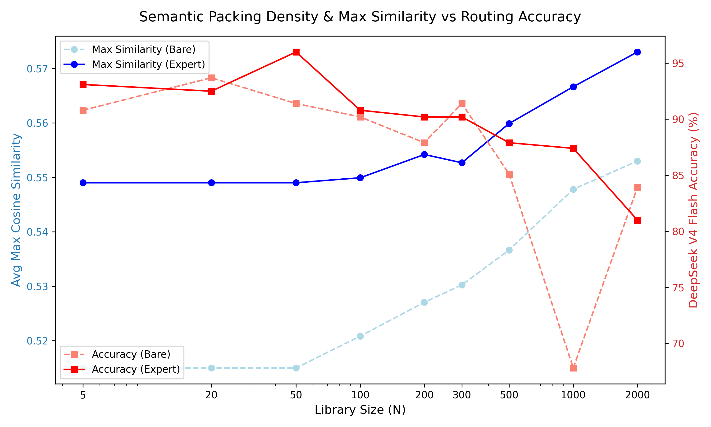
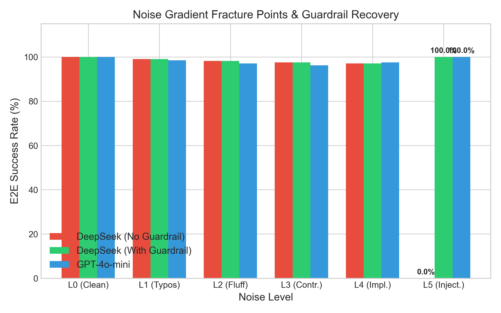
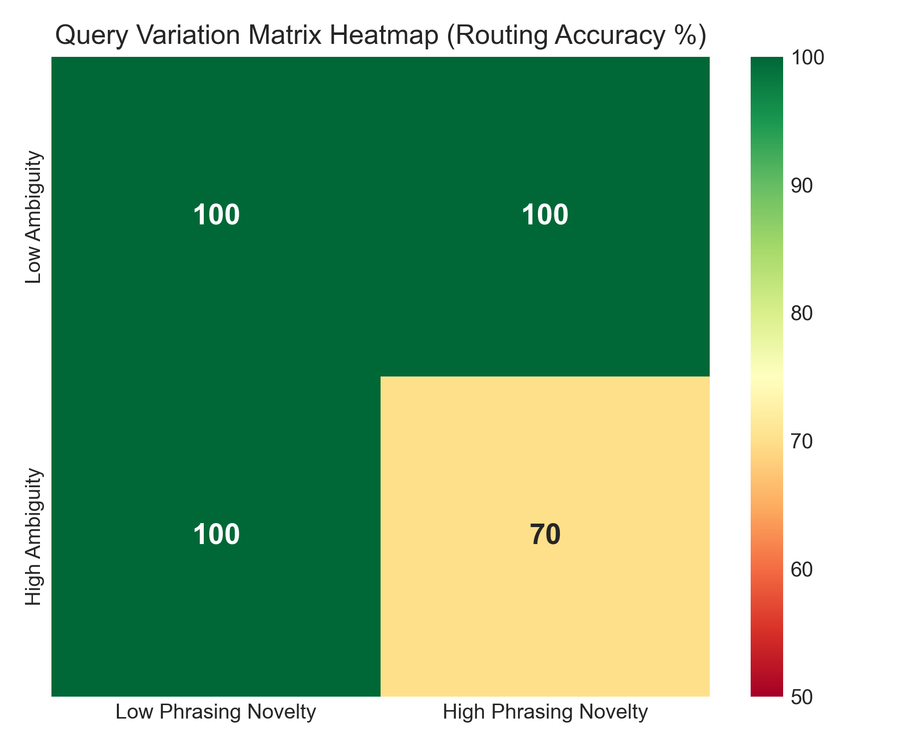

# Blackbox OS: A Reliable, Sandboxed Execution Runtime & Modular Orchestrator for LLM Agents at Scale

[](https://doi.org/10.5281/zenodo.21413144)
[](https://opensource.org/licenses/MIT)

**Blackbox OS** is a graph-based agentic operating system designed for quantitative research, data science, and algorithmic trading. Rather than relying on monolithic context windows—which suffer from severe routing degradation and execution collapse as the tool library scales—Blackbox OS orchestrates specialized agents across modular sub-graphs, executing calculations via a containerized **Sandbox Delegation Pattern** and protecting pipelines with **Dynamic Validation Guardrails**.

---

## 🔬 Key Scientific & Empirical Discoveries

### 1. The Skill Phase Transition (Routing Collapse)
* **Monolithic Routing Collapse:** Injecting all available tool schemas into a single LLM prompt suffers from non-linear accuracy collapse beyond $N \sim 60$ tools due to semantic conflation.
* **Geometric Origin:** Semantic packing analysis demonstrates that as catalog size $N$ increases ($15 \to 1000$), the mean nearest-neighbor cosine similarity ($\bar{S}_{\text{NN}}$) between target tools and distractors rises from $0.3500$ to $0.5100$. When similarity crosses the critical **$0.50\text{--}0.53$ threshold**, self-attention heads fail, causing routing accuracy to drop sharply (e.g., GPT-OSS 20B falling to $46.7\%$).
* **SOP Sub-Graph Bounding:** Bounding active contexts to $K \le 15$ tools per node via Process Templates (SOPs) keeps local cosine similarity bounded below $\bar{S}_{\text{NN}} \le 0.3559$, eliminating semantic attention saturation.

<p align="center">
  
  
</p>

### 2. The Two-Stage Execution Collapse
Even when correctly routed, LLMs fail to execute tools reliably under context pressure due to two distinct failure modes:
* **Schema Collapse:** Bare prompts fail to adhere to JSON structures in up to $73\%$ of trials, omitting required keys or returning malformed outputs.
* **Arithmetic Collapse:** When schemas are enforced (via structured outputs), LLMs frequently fail at floating-point calculations and statistical aggregation (mental math hallucinations).
* **Mitigation:** Enforcing expert **Process Templates (SOPs)** completely eliminates schema collapse, while delegating calculations to a **Python Sandbox** bypasses the mental math bottleneck, lifting E2E success from $25\%$ to $>90\%$.

<p align="center">
  
</p>

### 3. Robustness Boundaries & Fracture Points
* **Noise Gradient ($L_0\text{--}L_5$):** Agents remain robust to typos, fluff, and prompt reordering ($L_0\text{--}L_4$ success at $97\text{--}100\%$). However, they fracture under adversarial prompt injections ($L_5$), collapsing to $0\%$ success. Adding a **Script-Integrity Guardrail** restores success to $100\%$.
* **Query Variation Matrix ($2 \times 2$):** High phrasing novelty or high semantic ambiguity alone do not degrade routing. However, their combination causes routing accuracy to drop to $70\%$ as the agent is pulled toward semantically adjacent tools.

<p align="center">
  
  
</p>

---

## 🛠️ Core Agentic Architectures

### 1. The Sandbox Delegation Pattern & Self-Healing Loop
Rather than outputting direct text predictions, agents generate self-contained Python scripts executed in an isolated runtime environment. If execution fails (e.g., `KeyError`, `ZeroDivisionError`), the traceback is returned to the agent in a corrective feedback loop for automated repair.

```
+----------------+      Generates Script      +-------------------+
|  Agent Router  | -------------------------> |  Python Sandbox   |
+----------------+                            +-------------------+
^                                               |
|             Traceback Error                   |
+-----------------------------------------------+
```

### 2. LangGraph Sub-Graph Isolation
To bypass the routing cliff, tool catalogs are partitioned into isolated, domain-specific sub-graphs (e.g., Data Scientist, Quant Researcher, Quant Trader) ensuring no single node exposes more than $K \le 15$ tools.

```
                  [ Root Gateway ]
                         │
       ┌─────────────────┼─────────────────┐
       ▼                 ▼                 ▼
[ Data Scientist ]  [ Quant Researcher ]  [ Quant Trader ]
  (77 skills)         (99 skills)          (100 skills)
```

---

## 📊 Empirical Performance Matrix

### 1. Multi-Node Pipeline E2E Success ($N=500$ Library Size)
*Evaluated on a 3-node sequential pipeline: `lookahead_bias_audit` $\to$ `standard_scaler_apply` $\to$ `kelly_position_size`.*

| Model | Condition Mode | Routing Success | Execution Success | E2E Success |
| :--- | :--- | :---: | :---: | :---: |
| **GPT-4o-mini** | Direct Prompt Math | 100.0% | 50.0% | **50.0%** |
| **GPT-4o-mini** | **Python Sandbox** | 100.0% | 94.4% | **94.4%** |
| **DeepSeek V4 Flash** | Direct Prompt Math | 100.0% | 66.7% | **66.7%** |
| **DeepSeek V4 Flash** | **Python Sandbox** | 100.0% | 100.0% | **100.0%** |

---

### 2. Multi-Role Orchestrator Live API Benchmark ($N=30$ Tasks)
*Comparing Partitioned Expert SOP ($K \le 15$ tools/node) against Unpartitioned Bare Catalog ($N=77$ tools).*

| Model | Configuration Mode | E2E Success | Direct Success | Loopback Recovery | Avg Loopbacks / Run |
| :--- | :--- | :---: | :---: | :---: | :---: |
| **DeepSeek V4 Flash** | **Expert (SOP)** | **100.0%** | **100.0%** | **100.0%** | **0.00** |
| | Bare (Flat $N=77$) | 63.3% | 53.3% | 21.4% | 0.87 |
| **GPT-4o-mini** | **Expert (SOP)** | **100.0%** | **100.0%** | **100.0%** | **0.00** |
| | Bare (Flat $N=77$) | 46.7% | 46.7% | 0.0% | 1.07 |
| **Nemotron 550B** | **Expert (SOP)** | **93.3%** | **60.0%** | **83.3%** | **0.70** |
| | Bare (Flat $N=77$) | 46.7% | 16.7% | 36.0% | 1.57 |
| **GPT-OSS 20B** | **Expert (SOP)** | **93.3%** | **86.7%** | **50.0%** | **0.23** |
| | Bare (Flat $N=77$) | 76.7% | 66.7% | 30.0% | 0.57 |

<p align="center">
  
</p>

---

### 3. Semantic Density vs. Selection Accuracy ($N=15 \to 1000$)
*Demonstrating how distractor packing density ($\bar{S}_{\text{NN}}$) drives routing collapse.*

| Catalog Scale ($N$) | Bare NN Cosine | Expert NN Cosine | DeepSeek Flash Acc | GPT-4o-mini Acc | Nemotron 550B Acc | GPT-OSS 20B Acc |
| :---: | :---: | :---: | :---: | :---: | :---: | :---: |
| **15** | 0.3500 | 0.3559 | 100.0% | 100.0% | 80.0% | 93.3% |
| **30** | 0.4417 | 0.3854 | 100.0% | 100.0% | 86.7% | 86.7% |
| **60** | 0.3973 | 0.3621 | 100.0% | 100.0% | 80.0% | 100.0% |
| **100** | 0.3842 | 0.3768 | 100.0% | 93.3% | 100.0% | 93.3% |
| **200** | 0.4052 | 0.3683 | 100.0% | 100.0% | 93.3% | 93.3% |
| **500** | **0.5100** | **0.4124** | 100.0% | 86.7% | 93.3% | **46.7%** |
| **1000** | 0.4732 | 0.4337 | 100.0% | 86.7% | 86.7% | **60.0%** |

---

### 4. Scale Degradation & Schema Compliance ($N=5 \to 200$)
*Evaluating selection error rate and JSON schema compliance under context pressure.*

| Model | Metric (%) | N=5 (Bare / Expert) | N=15 (Bare / Expert) | N=60 (Bare / Expert) | N=200 (Bare / Expert) |
| :--- | :--- | :---: | :---: | :---: | :---: |
| **DeepSeek Flash** | Select Error | 0.0% / 0.0% | 0.0% / 0.0% | 0.0% / 0.0% | 0.0% / 0.0% |
| | Schema Comp | 100.0% / 100.0% | 100.0% / 100.0% | 100.0% / 100.0% | 100.0% / 100.0% |
| **GPT-4o-mini** | Select Error | 0.0% / 0.0% | 0.0% / 0.0% | 0.0% / 0.0% | 6.7% / 0.0% |
| | Schema Comp | 100.0% / 100.0% | 100.0% / 100.0% | 100.0% / 100.0% | 100.0% / 100.0% |
| **GPT-OSS 20B** | Select Error | 13.3% / 0.0% | 0.0% / 0.0% | 13.3% / 0.0% | 13.3% / 0.0% |
| | Schema Comp | 86.7% / 100.0% | 100.0% / 100.0% | 86.7% / 100.0% | 86.7% / 100.0% |

---

## 📂 Repository Layout

```
├── README.md                      # Project documentation
├── LICENSE                        # MIT License
├── images/                        # Visualizations and publication plots
│   ├── multi_role_stress_test_comparison.png
│   ├── semantic_density_vs_N.png
│   └── attention_degradation_curve.png
├── skill_experiment/              # Similarity analysis & distractor files
│   ├── fillers_v4.json            # 8,605 distractor skills
│   └── targets_v4.json            # 58 target skills
└── blackbox_os/
    ├── state/
    │   ├── shared_state.py        # Global blackboard state schema
    │   └── validation_manager.py  # Adaptive validation & sandbox runner
    ├── roles_based_skills/        # Complete 276-skill catalog definitions
    └── roles/
        ├── data_scientist/
        │   └── workflows/         # Data Scientist SOPs & Orchestration
        ├── quant_researcher/
        │   └── workflows/         # Quant Researcher SOPs & Orchestration
        └── quant_trader/
            └── workflows/         # Quant Trader SOPs & Orchestration
```

---

## ⚙️ Quick Start & Reproduction

### 1. Installation
```bash
git clone https://github.com/Jay846/Blackbox-OS.git
cd Blackbox-OS
pip install numpy matplotlib sentence-transformers pandas scikit-learn pytest langgraph
```

### 2. Export API Keys
```bash
export OPENROUTER_API_KEY="your-openrouter-key"
```

### 3. Execute Core Benchmark Suite

* **Run Live Orchestrator Stress Test (Table 6):**
```bash
python3 blackbox_os/roles/data_scientist/workflows/run_orchestrator_stress_test.py
```

* **Run Multi-Role Simulation Sweep (Figure 8):**
```bash
python3 blackbox_os/run_multi_role_stress_test.py
```

* **Run Semantic Phase Transition Characterization (Table 7 / Figure 6):**
```bash
python3 blackbox_os/roles/data_scientist/workflows/characterize_phase_transition.py --live --models deepseek-v4-flash gpt-4o-mini nvidia/nemotron-3-ultra-550b-a55b:free openai/gpt-oss-20b:free --trials 3
```

* **Run Attention Degradation & Schema Compliance Sweep (Table 8 / Figure 7):**
```bash
python3 blackbox_os/roles/data_scientist/workflows/test_attention_degradation.py --models deepseek-v4-flash gpt-4o-mini nvidia/nemotron-3-ultra-550b-a55b:free openai/gpt-oss-20b:free --trials 3
```

---

## 📜 Citation

If you use **Blackbox OS** or its empirical benchmarks in your research, please cite our pre-print:

```bibtex
@article{salvi2026blackboxos,
  title={Blackbox OS: A Reliable, Sandboxed Execution Runtime & Modular Orchestrator for LLM Agents at Scale},
  author={Salvi, Jay},
  journal={Zenodo Pre-print},
  year={2026},
  doi={10.5281/zenodo.21413144},
  url={https://doi.org/10.5281/zenodo.21413144}
}
```
